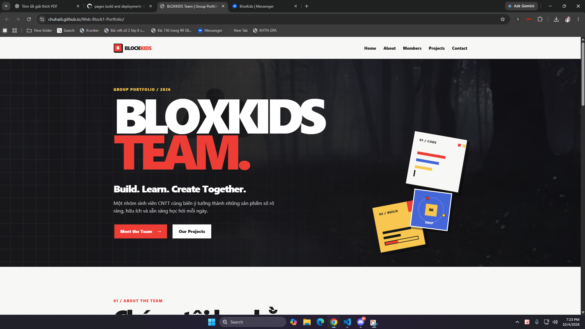
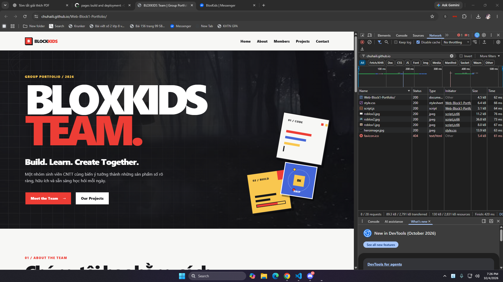
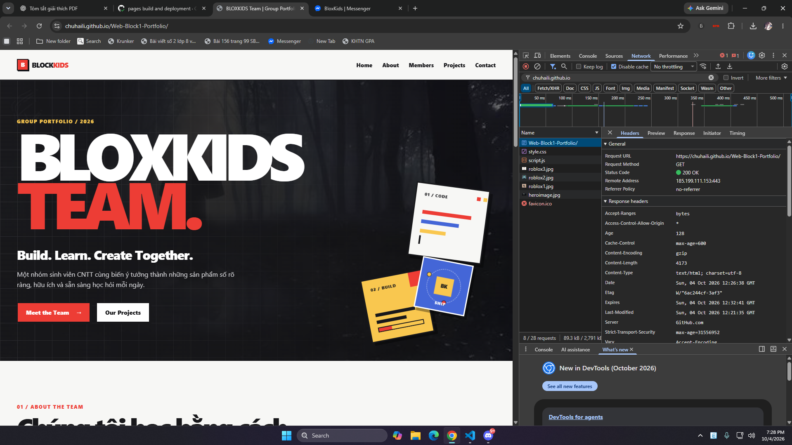
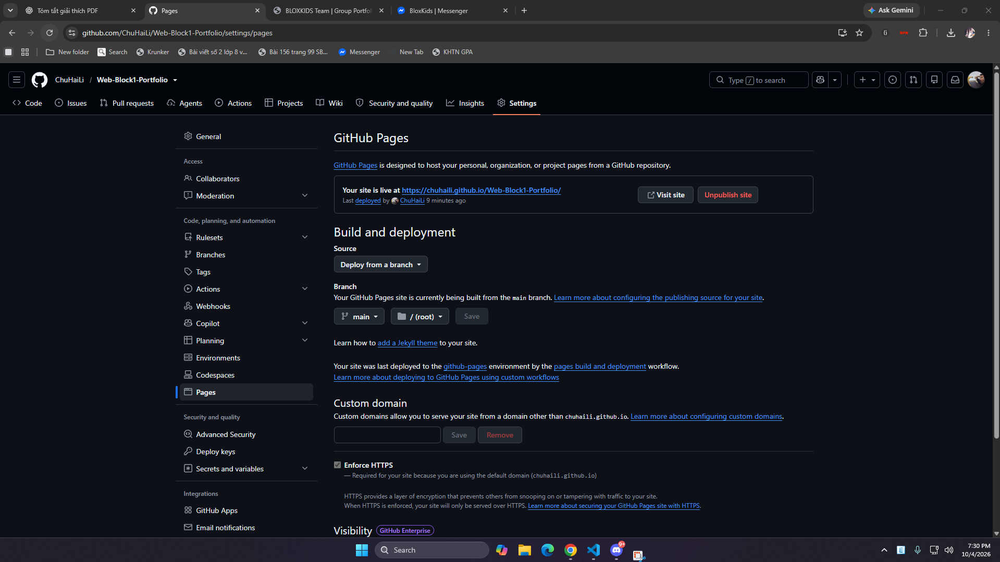
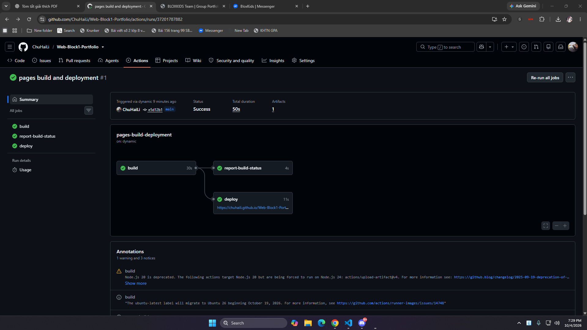

## 2. Public Hosting

### 2.1. So sánh các nền tảng Public Hosting

| Tiêu chí                                 | **GitHub Pages**                          | **Vercel**                              | **Render**                                                                                  | **Railway**                                                      |
| ---------------------------------------- | ----------------------------------------- | --------------------------------------- | ------------------------------------------------------------------------------------------- | ---------------------------------------------------------------- |
| **Loại dịch vụ**                         | Static Site Hosting                       | Frontend & Serverless PaaS              | Cloud Hosting đa năng                                                                       | Container / Backend PaaS                                         |
| **Mức độ phù hợp với dự án HTML/CSS/JS** | Sinh ra cho website tĩnh                  | Rất tốt, đặc biệt với React/Next.js     | Có hỗ trợ Static Site nhưng cấu hình phức tạp hơn                                           | Tập trung vào container/backend, không cần thiết cho dự án này   |
| **Chi phí**                              | **Miễn phí**                              | **Miễn phí** với gói Hobby              | **Miễn phí** theo chính sách hiện hành                                                      | Có giới hạn sử dụng miễn phí, phù hợp hơn cho thử nghiệm/backend |
| **Cold Start**                           | **Không đáng kể** – website luôn sẵn sàng | **Không đáng kể** với static deployment | Có thể có hiện tượng service ngủ và cần thời gian khởi động lại đối với một số loại service | Phụ thuộc vào loại service/container                             |
| **Tích hợp với GitHub**                  | Tích hợp trực tiếp                        | Tích hợp GitHub qua OAuth               | Hỗ trợ kết nối GitHub                                                                       | Hỗ trợ kết nối GitHub                                            |
| **Mức độ đơn giản**                      | Rất đơn giản                              | Rất đơn giản                            | Khá nhiều tùy chọn                                                                          | Phức tạp hơn nhu cầu dự án                                       |
| **Phù hợp với bài tập**                  | **Rất phù hợp**                           | Rất phù hợp                             | Có thể sử dụng                                                                              | Không cần thiết                                                  |

---

### 2.2. Nền tảng được lựa chọn

---

#### QUYẾT ĐỊNH: CHỌN GITHUB PAGES

##### 1. Tận dụng hạ tầng GitHub hiện có
Có sẵn repository trên GitHub: **Repository:** `ChuHaiLi/Web-Block1-Portfolio`
Việc triển khai GitHub Pages được thực hiện trực tiếp từ repository hiện có, do đó **không cần tạo thêm tài khoản trên một nền tảng hosting khác**.
##### 2. Phù hợp với bản chất của dự án
Website hiện tại là một **Static Website**, được xây dựng bằng:
- **HTML5** – xây dựng cấu trúc trang.
- **CSS3** – thiết kế giao diện và responsive.
- **JavaScript** – xử lý các tương tác phía client.
Website **không sử dụng backend động hoặc cơ sở dữ liệu**, vì vậy GitHub Pages đáp ứng đúng nhu cầu của dự án mà không cần đến các tính năng backend phức tạp.
##### 3. Đơn giản
GitHub Pages cung cấp một URL public cố định có thể truy cập trực tiếp website thông qua Internet.
Thuận lợi:
- Không cần chạy server thủ công trên máy cá nhân.
- Không cần duy trì một backend riêng.
- Có thể truy cập website từ bất kỳ thiết bị nào có Internet.
- Dễ dàng chia sẻ URL.
##### 4. Miễn phí và không phát sinh chi phí
- GitHub Pages phù hợp với một bài tập website tĩnh vì có thể sử dụng để triển khai website mà **không cần thuê máy chủ riêng**.
- Không cần sử dụng các dịch vụ container hoặc backend PaaS như Railway khi dự án hiện tại không có nhu cầu chạy backend.
##### 5. Hỗ trợ HTTPS
Website được cung cấp thông qua **HTTPS**, giúp việc truy cập an toàn và phù hợp với một website public.
URL của website: **[https://chuhaili.github.io/Web-Block1-Portfolio/](https://chuhaili.github.io/Web-Block1-Portfolio/)**
#### KẾT LUẬN
Dựa trên các tiêu chí về **tính phù hợp, sự đơn giản, khả năng tích hợp với GitHub và nhu cầu thực tế** => lựa chọn **GitHub Pages** làm nền tảng Public Hosting.

### 2.3. Kết quả triển khai

Website được triển khai từ branch `main`, thư mục `/(root)` của repository GitHub:

`ChuHaiLi/Web-Block1-Portfolio`

Public URL:

**https://chuhaili.github.io/Web-Block1-Portfolio/**

Sau khi triển khai, website có thể được truy cập công khai qua Internet và các tài nguyên chính gồm HTML, CSS, JavaScript và hình ảnh đều được tải thành công.

### 2.4. Minh chứng Public Hosting

**Evidence 1 – Website public**

Ảnh chụp website sau khi triển khai cho thấy giao diện được hiển thị đầy đủ trên trình duyệt và thanh địa chỉ sử dụng URL:

`https://chuhaili.github.io/Web-Block1-Portfolio/`

Điều này chứng minh website đã được public và có thể truy cập qua Internet.

---

**Evidence 2a – Network Requests**

Sau khi mở DevTools → Network và reload trang, browser gửi các HTTP request để tải những tài nguyên cần thiết.

Các tài nguyên chính đều trả về trạng thái `200 OK`, bao gồm:

- Document chính `Web-Block1-Portfolio/`
- `style.css`
- `script.js`
- `heroimage.jpg`
- `roblox1.jpg`
- `roblox2.jpg`
- `roblox3.jpg`

Request `favicon.ico` trả về `404 Not Found` do website không có file favicon tương ứng. Request này không ảnh hưởng đến hoạt động chính của website.

Kết quả Network chứng minh website và các tài nguyên cần thiết đang được phục vụ thành công từ public hosting.

---

**Evidence 2b – HTTP Request/Response**

Khi kiểm tra document chính trong Network → Headers, browser gửi:

- Request URL: `https://chuhaili.github.io/Web-Block1-Portfolio/`
- Request Method: `GET`

Server trả về:

- Status Code: `200 OK`
- Content-Type: `text/html; charset=utf-8`
- Server: `GitHub.com`

Điều này cho thấy browser đã gửi một HTTP GET request tới URL public và GitHub Pages đã trả về HTML của website thành công.

---

**Evidence 3 – Deployment thành công**

Trong phần Settings → Pages của repository, GitHub hiển thị trạng thái:

**“Your site is live at https://chuhaili.github.io/Web-Block1-Portfolio/”**

GitHub Pages được cấu hình deploy từ:

- Branch: `main`
- Folder: `/(root)`

Điều này xác nhận quá trình public deployment đã hoàn tất thành công.

Ngoài ra, GitHub Actions cũng ghi nhận workflow `pages build and deployment` hoàn tất với trạng thái **Success**, bao gồm cả bước build và deploy.

